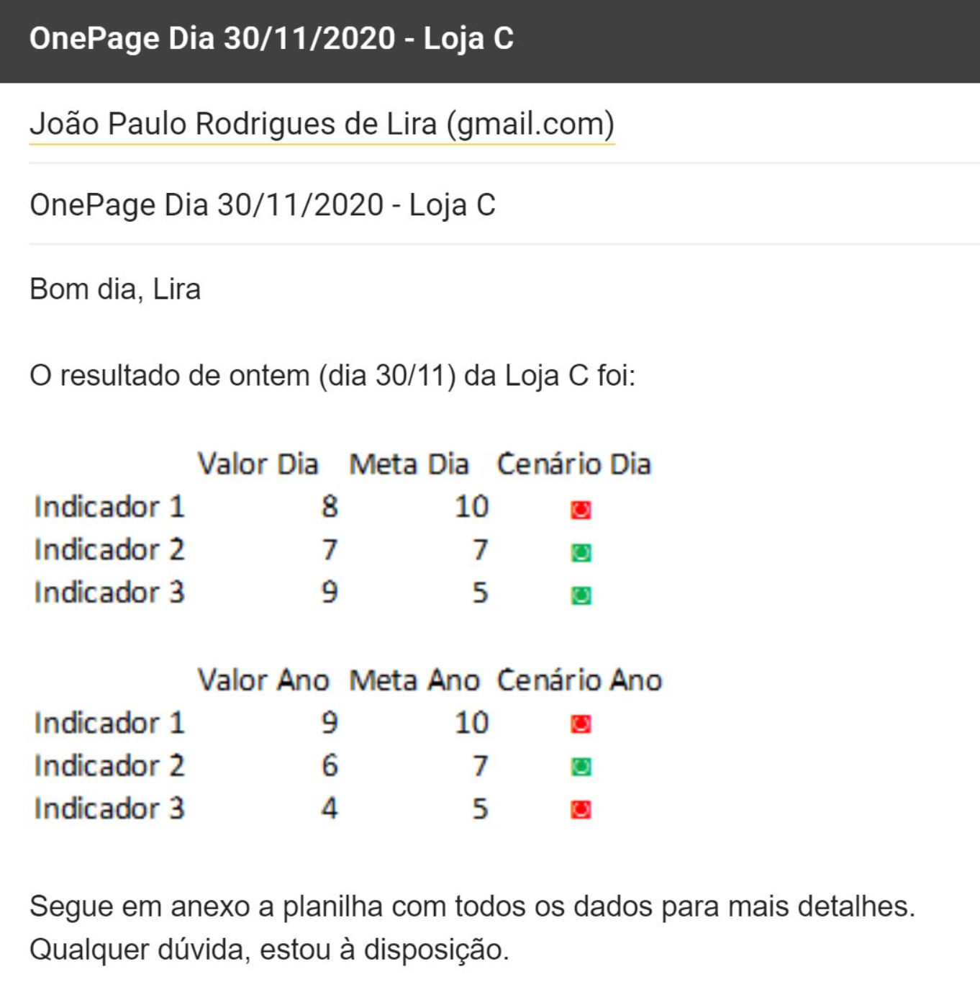

#  Automação de Indicadores de Lojas de Varejo

Este projeto simula um cenário real de trabalho em uma rede varejista, onde o objetivo é automatizar o processo de geração e envio de indicadores diários (OnePages) para as lojas, utilizando Python.

---

## Objetivo

Automatizar a criação de relatórios com indicadores de desempenho (OnePages) para cada loja da rede e enviá-los por e-mail de forma personalizada, junto com os dados individuais de cada loja, além de consolidar relatórios e rankings para a diretoria.

---

## 🛠️ Exemplo de email 

---

## 🛠️ Tecnologias Utilizadas

- Python 3.12.4
- pandas
- pathlib
- email (biblioteca para envio de e-mails)

---
